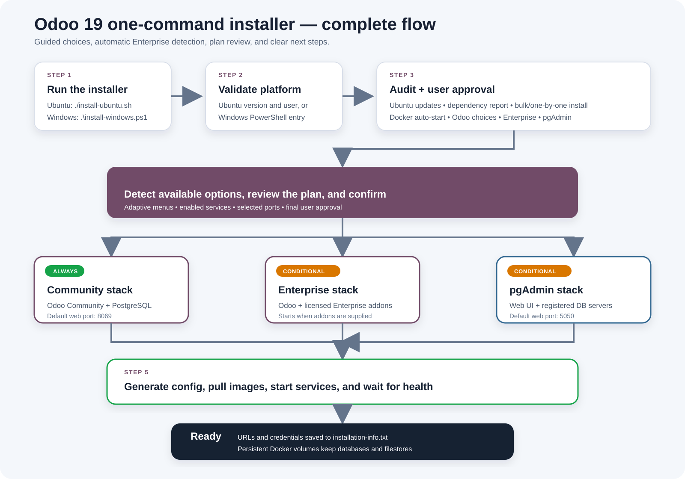
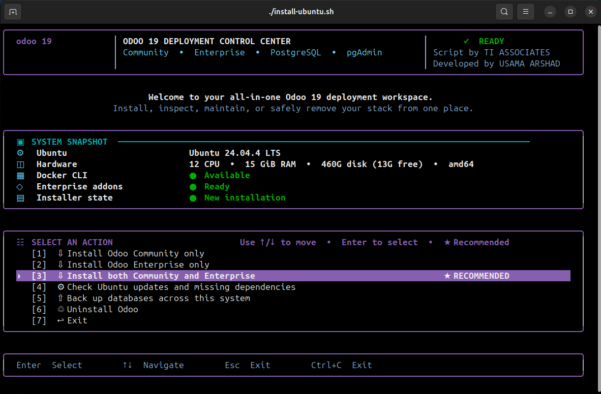
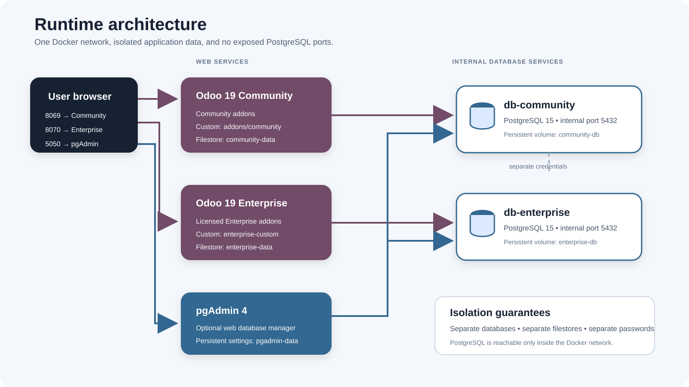

# Odoo 19 multi-mode one-command installer

Guided installers for Ubuntu and Windows that run Community only, Enterprise
only, or both Odoo 19 editions, with optional pgAdmin, as isolated Docker
services.

**Script by TI ASSOCIATES · Developed by USAMA ARSHAD**



## What gets installed

| Component | When it starts | Default address |
|---|---|---|
| Odoo 19 Community + PostgreSQL | Community or Both is selected | `http://SERVER-IP:8069` |
| Odoo 19 Enterprise + PostgreSQL | Enterprise or Both is selected and licensed addons exist | `http://SERVER-IP:8070` |
| pgAdmin 4 web application | When the user answers `y` | `http://SERVER-IP:5050` |

Community and Enterprise use separate databases, passwords, filestores, ports,
configuration files, and custom-addon folders. pgAdmin can manage both databases
without exposing PostgreSQL ports to the host network.

## Requirements

- Ubuntu 22.04 or newer, or an Ubuntu-based distribution such as Linux Mint or
  Pop!_OS, with a normal sudo-enabled user; or Windows 10/11 with PowerShell.
  Releases newer than 26.04 run with a note that they are untested.
- An internet connection for installing Docker when needed and pulling images.
- A valid Odoo Enterprise subscription and a local copy of the Odoo 19
  Enterprise addons if Enterprise will be used.
- Enough free disk space for Docker images, databases, filestores, and backups.

Do not run the Ubuntu installer as `root`. Run it as your normal user and enter
your sudo password when Ubuntu requests it.

## Run the installer

### Ubuntu 22.04 or newer

```bash
chmod +x install-ubuntu.sh
./install-ubuntu.sh
```

When run interactively, the Ubuntu script first clears the previous terminal
output and then opens a keyboard-controlled dashboard before performing package
maintenance or starting services. Use the Up/Down arrow keys and Enter, press a
number directly, or press Esc/Ctrl+C to exit. The full dashboard adapts between
112–132 columns and uses a 33–42 row viewport. It stays centered when the
terminal is larger. On interactive terminals smaller than 112×33, a full-screen
resize guard shows the current and required sizes and waits; resizing the window
automatically opens the dashboard. Press Q, Esc, or Ctrl+C to exit from that
screen. Redirected, automated, `NO_COLOR`, and basic-terminal runs use the clean
numbered menu instead.



```text
============================================================
             ODOO 19 DEPLOYMENT CONTROL CENTER
                    Installer v1.0.0
     Community • Enterprise • PostgreSQL • pgAdmin
                  Script by TI ASSOCIATES
              Developed by USAMA ARSHAD
============================================================

Quick system snapshot
  Ubuntu                 Ubuntu 24.04 LTS
  Hardware               12 CPU • 31 GiB RAM • 98G disk (74G free) • amd64
  Docker CLI             Available
  Enterprise addons      Ready
  Installer state        New installation

[MENU] What would you like to do?
------------------------------------------------------------
  [1] Install Odoo Community only
  [2] Install Odoo Enterprise only
  [3] Install both Community and Enterprise
  [4] Check Ubuntu updates and missing dependencies
  [5] Back up databases across this system
  [6] Uninstall Odoo
  [7] Exit
Choose an option [3]:
```

When complete Enterprise addons are available, Both is highlighted as the
recommended default. Without Enterprise addons, Community becomes the safe
recommended default instead.

Option 5 opens the Ubuntu system-wide database backup wizard. It is not limited
to Odoo or to databases created by this installer. The read-only discovery pass
checks native Ubuntu PostgreSQL clusters, native MySQL/MariaDB, every matching
Docker container regardless of its Compose project, and primary SQLite database
files in project and deployment locations such as `~/Projects`, `~/Desktop`,
`/var/lib`, `/var/www`, `/opt`, `/srv`, `/mnt`, and `/data`. Databases are not
filtered by application name or schema.

The selection list is deliberately limited to primary data and grouped into
three categories: PostgreSQL server databases, MySQL/MariaDB server databases,
and SQLite project/deployment databases. PostgreSQL templates and the `postgres`
maintenance database, MySQL/MariaDB metadata and privilege schemas, browser or
desktop-application state, caches, dependencies, sessions, and test SQLite files
are excluded. This prevents hundreds of files such as Chromium, Zoom, Cursor,
package-manager, and cache databases from overwhelming the backup menu.

Stopped native database services and stopped database containers can be started
temporarily with the user's permission and are returned to their original state.
If an instance cannot be queried with local, sudo, or container-configured
credentials, the wizard requests a username and hidden password; entering no
username skips that native instance, and `S` skips a Docker instance. Passwords
remain in memory and are never written into the backup.

All accessible results appear in one combined list with engine, source,
database/file name, and size. Select several entries with `1,3,4`, a range such
as `1-3`, or `A` for all. One `.rar` archive then contains PostgreSQL
custom-format dumps, MySQL/MariaDB SQL dumps, and consistent SQLite online-backup
copies for the selected entries. Archives are saved under `backups/` with mode
`600`; this folder is Git-ignored. If `rar` or the SQLite command-line utility is
required but missing, installation needs user approval and the package is
recorded as installer-managed.

The scanner currently supports PostgreSQL, MySQL, MariaDB, and SQLite. A truly
universal database backup format does not exist: MongoDB, Redis, SQL Server,
Oracle, and other engines require their own discovery, authentication, and dump
tools and are not yet included in this backup option.

Option 6 has an edition-aware uninstall wizard. It can remove Community only,
Enterprise only, both Odoo editions while keeping pgAdmin, or the complete
installer stack. Before presenting any destructive choice, it performs a
read-only system audit. The audit discovers containers, orphan containers,
volumes and their mount locations, project networks, generated files, tracked
packages, Docker repository setup, installed source/addon copies, and source
folders that must be preserved. Docker resources must carry the expected
`odoo19-dual` Compose ownership label; a missing or mismatched label is reported
and skipped instead of being deleted.

For every scope, the recommended choice removes containers but preserves
databases, filestores, and generated files. Permanent deletion requires a
separate data choice. Before the delete confirmation, the wizard offers to scan
the system databases, lets the user select one or several database names, and
creates a RAR backup under `backups/`. If backup is cancelled, fails, or finds no
accessible database, deletion does not continue automatically; the user must
retry, explicitly approve continuing without a backup, or cancel. Permanent
deletion then requires a scope-specific confirmation such as
`DELETE COMMUNITY`, `DELETE ENTERPRISE`, `DELETE BOTH`, or `DELETE ALL`, followed
by approval of the verified plan. The wizard never performs a broad
filename-based system deletion: unrelated Odoo or Docker installations remain
outside its deletion inventory.

After complete-stack removal, the wizard separately asks whether Docker and
dependencies installed by this installer should also be removed. First it scans
for containers, volumes, and custom networks outside the `odoo19-dual` project.
If another Docker workload is found, Docker Engine removal is blocked so another
application is not broken. The private, Git-ignored `.installer-state` file
records packages, Docker repository files, and Docker-group access created by
the installer. Recorded cleanup requires `REMOVE DEPENDENCIES`.

Older installations may not have an ownership record. In that case, the wizard
lists Docker Engine packages detected from Docker's official Ubuntu repository.
If no non-Odoo Docker resources exist, those packages and the official Docker
APT source/key can be removed with the separate confirmation
`REMOVE DETECTED DOCKER`. Generic untracked Ubuntu packages are never guessed or
removed.

For Enterprise-only, both-editions, and complete-stack removal, the audit also
lists eligible installed copies under `/opt/odoo/odoo19`. The user may keep them
(the default) or permanently remove only the listed Enterprise/custom-addon
copies by typing `DELETE INSTALLED SOURCE`. The original licensed
`enterprise-19.0` folder and addon folders inside the Git checkout are always
preserved, so the installer's only copy of user-supplied source is not erased.
If Docker has already been removed outside the installer, Option 6 still scans
for leftover generated configuration and `/opt` addon copies and can delete them
with the confirmation `DELETE LOCAL ODOO FILES`.

If Docker is missing, the script installs Docker Engine and the Compose plugin
from Docker's official Ubuntu repository after receiving user approval. Before
the Odoo questions, it can update the APT package lists and upgrade currently
installed Ubuntu packages, then displays which prerequisites are installed or
missing. Missing items can be installed in bulk, approved one by one, or left
unchanged by cancelling. This package upgrade does not perform a major Ubuntu
release upgrade such as 22.04 to 24.04.

After Docker is available, the script explicitly enables and starts
`docker.service`, so Docker starts automatically during future system boots. It
may use `sudo docker` for the current run; log out and back in later if you want
the new Docker group membership to take effect.

### Windows 10 / 11

Open PowerShell in this repository folder:

```powershell
Set-ExecutionPolicy -Scope Process Bypass
.\install-windows.ps1
```

If Docker Desktop is missing, the script asks permission, installs it through
`winget`, and then stops. It also configures Docker Desktop to launch whenever
the current Windows user signs in. Restart Windows, sign in, accept Docker's
terms if prompted, and run the same installer command again. On later runs, the
installer starts Docker Desktop itself and waits up to three minutes when its
engine is not already ready.

## Questions the installer asks

Press Enter to accept the value shown in square brackets.
If a user mistypes a choice, port, Enterprise folder, email, or yes/no answer,
the installer explains the expected value and asks the same question again.

On Windows, `Install Docker Desktop now using winget? [Y/n]` appears first only
when Docker is missing. Answering `n` cancels cleanly; answering `y` installs
Docker Desktop and explains the required restart before Odoo setup continues.

### Ubuntu preparation questions

These appear after choosing install or dependency check from the main menu:

| Order | Prompt | Effect |
|---:|---|---|
| 1 | `Refresh package lists and upgrade installed Ubuntu packages now? [y/N]` | `y` runs `apt-get update` followed by a non-interactive `apt-get upgrade`. It does not change the Ubuntu release. |
| 2 | `Continue this installation before rebooting? [y/N]` | Shown only when Ubuntu reports that upgraded packages require a reboot. The safe default stops so the user can reboot and rerun. |
| 3 | `Choose an option [1]` | Shown only when prerequisites are missing. `1` installs everything missing, `2` asks permission for each item, and `3` cancels. |
| 4 | Individual package questions | Shown only in one-by-one mode for CA certificates, curl, OpenSSL, Docker Engine, and Docker Compose when each item is missing. |

Before prompt 3, the installer prints a status report similar to:

```text
Ubuntu prerequisite status
  CA certificates              INSTALLED
  curl                         INSTALLED
  OpenSSL                      INSTALLED
  Docker Engine / CLI          MISSING
  Docker Compose plugin        MISSING
  Docker system service        NOT INSTALLED
```

OpenSSL, Docker Engine, and Docker Compose are required to continue. If any of
them remain missing after the user's choices, the installer stops and explains
how to rerun it.

### Odoo installation questions

| Order | Prompt | What it controls |
|---:|---|---|
| 1 | `Choose a profile [1]` | `1` selects the lightweight testing server. `2` selects production and opens the hardware-aware performance advisor. |
| 2 | `Community web port [8069]` | Asked only when Community or Both was selected in the Ubuntu menu. |
| 3 | `Enterprise addons folder` | Asked only when Enterprise is selected and complete addons were not detected automatically. |
| 4 | `Enterprise web port [8070]` | Asked only when Enterprise will start. In Both mode it must differ from the Community port. |
| 5 | `Expected simultaneous ... users` | Production only. Enter active users expected at the same time, not the total number of accounts. Each selected edition has its own estimate. |
| 6 | `Choose a performance option [1]` | `1` applies the automatic recommendation, `2` accepts custom worker/cron/memory values, and `3` uses one safe worker per selected edition. |
| 7 | Custom performance questions | Shown only for option `2`. The installer validates HTTP workers, cron threads, and soft/hard memory limits and warns before accepting an overcommitted worker total. |
| 8 | `Add pgAdmin to this installation? [y/N]` | Enables the optional pgAdmin web application. A rerun with pgAdmin enabled instead asks whether to keep it enabled. |
| 9 | `pgAdmin web port [5050]` | Asked only when pgAdmin is enabled. It must differ from the selected Odoo ports. |
| 10 | `pgAdmin login email [admin@example.com]` | Asked only on the first pgAdmin setup. Existing pgAdmin data reuses the saved email. |
| 11 | `Start this installation now? [Y/n]` | Shows after a complete plan summary and provides a final chance to cancel before configuration or Enterprise addons are changed. |

Windows still uses its adaptive edition menu inside the guided wizard. The new
top-level action and uninstall menu are specific to the Ubuntu terminal script.

PostgreSQL passwords, separate Community and Enterprise Odoo master passwords,
and the pgAdmin login password are generated automatically with OpenSSL. The
master passwords are saved in the Git-ignored `installation-info.txt` file. On
Ubuntu, that file is created with a restrictive `umask` and mode `600`, so only
the installing user can read or modify it.

### Production performance advisor

The Ubuntu production profile detects logical CPUs and RAM, asks for expected
simultaneous users for each selected edition, and suggests Odoo HTTP workers.
It starts from Odoo's sizing guideline of about six simultaneous users per
worker, then caps the combined Community and Enterprise recommendation using:

- the theoretical CPU ceiling of `(CPU × 2) + 1`, with CPU reserved for cron;
- a RAM budget that reserves at least 2 GiB (or 25 percent on larger machines)
  for Ubuntu, Docker, PostgreSQL, pgAdmin, and filesystem cache; and
- a conservative 768 MiB RAM allowance per suggested worker.

See Odoo's official [worker and memory sizing guidance](https://www.odoo.com/documentation/19.0/administration/on_premise/deploy.html#builtin-server).

Automatic mode uses one cron thread per selected edition and 768 MiB soft / 1536
MiB hard memory limits per worker. Custom mode accepts 1–64 workers per selected
edition, 1–4 cron threads, and custom limits; an explicit extra confirmation is
required when the requested worker total exceeds the detected safe budget. Safe
mode uses one worker per selected edition. Testing mode keeps `workers = 0` and
does not open the production advisor.

The chosen mode, expected-user estimates, workers, cron threads, and limits are
saved in `.env`, written into each Odoo configuration, shown in the review, and
recorded in `installation-info.txt`. On reruns, saved values become the custom
defaults, while automatic mode recalculates against the machine's current
resources.

Example Community + pgAdmin installation when no Enterprise folder is detected:

```text
Choose an option [1]: 1
Refresh package lists and upgrade installed Ubuntu packages now? [y/N]: n
Choose a profile [1]:
Community web port [8069]:
Add pgAdmin to this installation? [y/N]: y
pgAdmin web port [5050]:
pgAdmin login email [admin@example.com]: admin@example.com
Start this installation now? [Y/n]:
```

When `enterprise-19.0/` is beside the installer, both scripts detect its full
path. Ubuntu copies it into `/opt/odoo/odoo19/enterprise`, matching the verified
production layout, while Windows keeps using the repository-local addon folders.
The initially detected source path is built from the installer's current
location, so Linux and Windows usernames are detected automatically instead of
being hard-coded.
On a rerun, selecting only one edition stops the other edition's previously
running containers, and disabling pgAdmin stops its existing container.

## Complete execution flow

1. **Validate the platform.** Ubuntu checks for Ubuntu 22.04 or newer (including
   Ubuntu-based distributions, resolved through their inherited codename), refuses to
   run as root, and detects the CPU count, total RAM, architecture, and root-disk
   capacity/free space shown in the system snapshot. Windows starts through
   PowerShell from the project folder.
2. **Choose an Ubuntu action.** The first menu offers Community, Enterprise,
   Both, dependency maintenance, system-wide database backup, edition-aware safe
   uninstall, or exit. The backup wizard can create one multi-engine RAR bundle,
   while uninstall can target one edition, both editions, or the
   complete stack and optionally remove only installer-tracked dependencies.
3. **Offer Ubuntu maintenance.** The Ubuntu script asks whether to refresh APT
   metadata and upgrade installed packages. If a reboot becomes necessary, the
   user can stop safely and continue after restarting the machine.
4. **Audit and prepare prerequisites.** Ubuntu displays CA certificates, curl,
   OpenSSL, Docker Engine, Compose, and Docker service status. Missing items are
   installed only after bulk or per-item approval. Windows checks Docker Desktop,
   can install it through `winget`, and configures it to start at user sign-in.
5. **Guide the user through choices.** Numbered menus select testing/production,
   optional pgAdmin, and only the ports relevant to the chosen Odoo editions.
   Production adds the hardware-aware worker, cron, and memory advisor. A recent
   Compose version with `--wait` support is required.
6. **Protect existing data.** The script detects installer-created Docker
   volumes. If data volumes exist but `.env` is missing, it stops instead of
   creating new passwords that cannot access the existing data.
7. **Prepare Enterprise.** The installer first detects existing copied addons or
   `enterprise-19.0/` beside the script. Manual path entry is requested only when
   complete Enterprise addons were not detected. The folder must contain addon
   manifests and `web_enterprise`. Ubuntu then stores the licensed source under
   `/opt/odoo/odoo19/enterprise` and prepares the shared custom-module directory
   `/opt/odoo/odoo19/custom_addons/<folder-name>`. The folder name is requested
   in the terminal; spaces are safely converted to underscores.
8. **Configure pgAdmin.** If selected, the script prepares pgAdmin login data,
   a server-definition file, and a protected PostgreSQL password file. It
   registers only the Community and/or Enterprise databases selected for this
   run.
9. **Generate or reuse configuration.** On the first run, database, separate
   Community/Enterprise Odoo master, and pgAdmin passwords are generated with
   OpenSSL. On reruns, saved credentials are preserved. `.env` and the Odoo
   configuration files are then updated with the current ports, environment
   mode, and per-edition performance settings.
10. **Review and confirm.** A summary shows the selected profile, editions, ports,
   pgAdmin choice, and automatic restart state before Odoo configuration or
   Enterprise addons are changed.
11. **Pull and start containers.** The pinned images are downloaded. Only the
   selected Odoo editions and optional pgAdmin start. Every created service has
   the `restart: unless-stopped` policy.
12. **Wait for health.** Docker Compose waits up to 300 seconds for all requested
   services. On Ubuntu, an already-active UFW firewall receives allow rules for
   the selected public web ports.
13. **Show next steps.** The terminal prints URLs, credentials, and browser setup
   guidance. The access information is also saved to `installation-info.txt`.

## Runtime architecture



| Web service | Internal database | Persistent storage | Start condition |
|---|---|---|---|
| `community` | `db-community` | `community-data`, `community-db` | Community or Both is selected |
| `enterprise` | `db-enterprise` | `enterprise-data`, `enterprise-db` | Enterprise or Both is selected and addons exist |
| `pgadmin` | Connects to the selected internal databases | `pgadmin-data` | User enables pgAdmin |

The two PostgreSQL services listen only on Docker's internal network. Only the
Odoo and pgAdmin web ports are published on the host. On Ubuntu, Enterprise code
is bind-mounted read-only from `/opt/odoo/odoo19/enterprise`, while the shared
custom directory is bind-mounted from
`/opt/odoo/odoo19/custom_addons/<folder-name>` into both Odoo editions.

## Automatic startup after a restart

No installer rerun is normally required after restarting the machine:

- **Ubuntu:** `docker.service` is enabled at boot. When the Docker daemon becomes
  ready, it starts the previously running Odoo, PostgreSQL, and optional pgAdmin
  containers automatically.
- **Windows:** Docker Desktop launches after the user who ran the installer signs
  in. When its engine becomes ready, the previously running containers start
  automatically. Docker Desktop does not provide this desktop workflow before a
  user signs in.
- **Containers:** Compose uses `restart: unless-stopped`. A normal reboot restarts
  them, but a service deliberately stopped with `docker compose stop` remains
  stopped. `docker compose down` removes the containers, so run the installer or
  `docker compose up -d` before expecting automatic restarts again.

Only services selected during installation will restart. For example, an
Enterprise-only setup does not start Community, and pgAdmin does not appear
unless it was enabled during installation.

## Files created or updated

Ubuntu keeps licensed and custom addon code in a stable production-style host
location outside the Git checkout:

```text
/opt/odoo/odoo19/
├── enterprise/                       # Licensed Odoo Enterprise addons
└── custom_addons/
    └── <your-folder-name>/             # Custom modules shared by both editions
```

The Ubuntu installer asks for this folder name before creating anything. For
example, entering `TI Associates` creates `TI_Associates/`. Place each custom
module directly inside the selected folder, so its manifest looks like
`/opt/odoo/odoo19/custom_addons/<folder-name>/my_module/__manifest__.py`.
Both Ubuntu Odoo containers mount this directory at `/mnt/extra-addons`.
Repository-local Community and Enterprise custom modules from an older installer
run are migrated without replacing an already-present module.

The installer repository continues to hold configuration and credentials:

```text
odoo19-one-command-installer/
├── .env                              # Image versions, ports, and credentials
├── installation-info.txt             # URLs and user-facing login details
├── config/
│   ├── community/odoo.conf           # Community database and runtime settings
│   ├── enterprise/odoo.conf          # Enterprise database and runtime settings
│   └── pgadmin/
│       ├── servers.json              # Automatically registered DB servers
│       └── pgpass                    # Automatic DB authentication for pgAdmin
└── addons/                            # Windows defaults and Ubuntu migration sources
    ├── community/
    ├── enterprise/
    └── enterprise-custom/
```

`.env`, `installation-info.txt`, generated configuration files, and legacy
repository-local Enterprise copies are excluded by `.gitignore`. Ubuntu's
`/opt/odoo/odoo19` source directories live outside the Git repository. Secret
files are made owner-readable only where container compatibility permits.

## First browser setup

### Odoo Community

1. Open the Community URL printed by the installer.
2. On Odoo's database creation screen, use the **Community Odoo master
   password** from `installation-info.txt`.
3. Choose a database name, administrator email, and administrator login
   password. You can also choose the language, country, and demo data.

### Odoo Enterprise

If Enterprise started, open its URL and repeat the database setup using the
separate **Enterprise Odoo master password**.

An Odoo master password controls database creation, restoration, duplication,
and deletion. It is not the administrator login password that you choose in the
browser.

### pgAdmin

pgAdmin is installed as a browser-based Docker service, not as the native
desktop application.

1. Open the pgAdmin URL from `installation-info.txt`.
2. Sign in with its saved **pgAdmin login email** and **pgAdmin login password**.
3. Expand the `Odoo 19` group in the left panel.
4. Open the registered server for the Community and/or Enterprise edition that
   was selected during installation.

The installer-generated `pgpass` file allows those registered servers to
connect without requesting the PostgreSQL password. Because
`PGADMIN_REPLACE_SERVERS_ON_STARTUP=True`, the installer-managed server list is
refreshed when pgAdmin starts; manually added server definitions may be replaced.

## First run compared with a rerun

| Item | First run | Rerun |
|---|---|---|
| Database passwords | Generated | Reused from `.env` |
| Odoo master passwords | Generated | Reused from `.env` or existing Odoo config |
| pgAdmin password | Generated | Reused from `.env` |
| Odoo ports and mode | Selected through guided menus | Asked again and configuration updated |
| Custom addons folder | User enters a folder name under `/opt/odoo/odoo19/custom_addons` | Saved name is offered as the default and can be changed |
| pgAdmin choice and port | Asked; disabled by default | Asked again; previous enabled state and port become defaults |
| Enterprise addons | Nearby folder is detected and copied to `/opt/odoo/odoo19/enterprise` on Ubuntu | Existing persistent addons are reused automatically when Enterprise is selected |
| Persistent databases and filestores | Created | Kept and reused |

If an existing database or pgAdmin volume is present but its required saved
credentials are missing, restore `.env` from backup before rerunning.

## Enterprise requirement

There is no separate official Odoo Enterprise Docker image. This installer uses
the official Odoo 19 image together with your licensed Enterprise addon files.
You must have a valid Odoo Enterprise subscription and a legal local copy of
those addons.

To add Enterprise after a Community-only installation, place the licensed folder
beside the installer and name it `enterprise-19.0`, then choose Enterprise or
Both from the Ubuntu main menu. Ubuntu stores and reuses the installed copy under
`/opt/odoo/odoo19/enterprise`. Add custom modules under
`/opt/odoo/odoo19/custom_addons/<folder-name>`, restart the relevant container,
then update the Apps list in Odoo.

## Useful commands

Run these commands from the repository folder:

```bash
# Show current service state
docker compose --profile pgadmin ps

# Follow logs
docker compose logs -f community
docker compose logs -f enterprise
docker compose --profile pgadmin logs -f pgadmin

# Stop or start pgAdmin only
docker compose --profile pgadmin stop pgadmin
docker compose --profile pgadmin start pgadmin

# Stop all containers but keep persistent data
docker compose --profile pgadmin down
```

Do not run `docker compose down -v` unless you deliberately want to delete all
Odoo databases, filestores, and pgAdmin data.

## Versions and upgrades

The default images are pinned so a future installation does not silently use
different software:

- Odoo: `odoo:19.0-20260908`
- PostgreSQL: `postgres:15.19`
- pgAdmin: `dpage/pgadmin4:9.17`

Before upgrading, back up both PostgreSQL databases and both Odoo filestores,
verify that the Enterprise addons match the target Odoo 19 build, and then
deliberately change `ODOO_IMAGE`, `POSTGRES_IMAGE`, or `PGADMIN_IMAGE` in `.env`.
Rerun the installer to pull and start the chosen images.

## Security and production note

Protect `.env` and `installation-info.txt`, and keep encrypted off-machine
backups. They contain credentials needed to administer or recover the services.

The `production` choice opens the hardware-aware advisor, but its result remains
a starting point rather than a load-test guarantee. Monitor real CPU, RAM,
database latency, and custom-module behavior before raising worker counts. The
installer does not configure a domain, TLS/HTTPS, reverse proxy, mail delivery,
monitoring, or automated backups. Before exposing the system to the internet,
add those controls, restrict Odoo and pgAdmin access with firewall rules, and
test database and filestore restoration.

## Troubleshooting

- **Docker engine is not ready:** Start Docker/Docker Desktop, wait until it is
  running, and rerun the installer.
- **A service does not become healthy within five minutes:** Run
  `docker compose --profile pgadmin ps` and inspect the relevant log command
  shown above.
- **A selected port is already in use:** Rerun the installer and choose a free,
  unique port.
- **`.env` is missing but Docker volumes remain:** Restore `.env` from the same
  installation backup. Do not invent replacement database passwords.
- **Enterprise does not start:** Confirm
  `/opt/odoo/odoo19/enterprise/web_enterprise/__manifest__.py` exists and the
  directory is readable, then rerun the installer.
